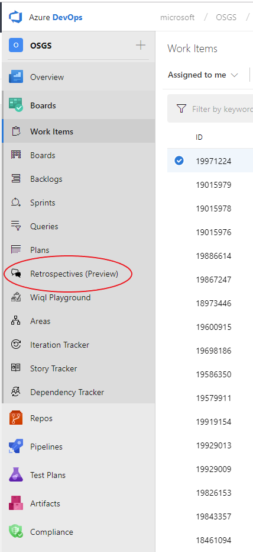
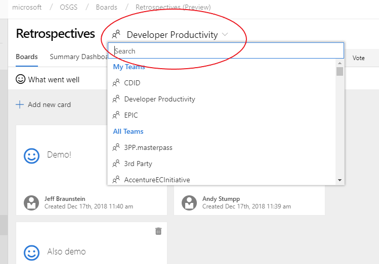
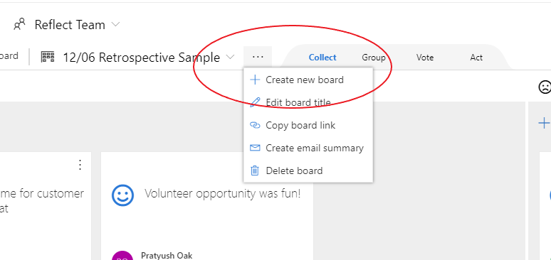
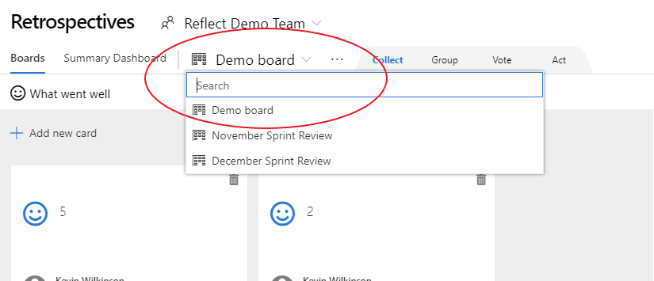
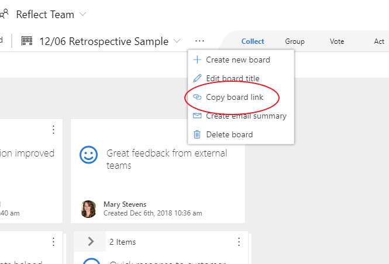
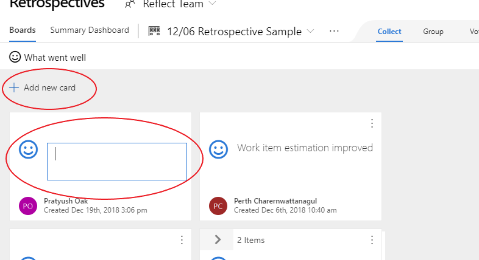
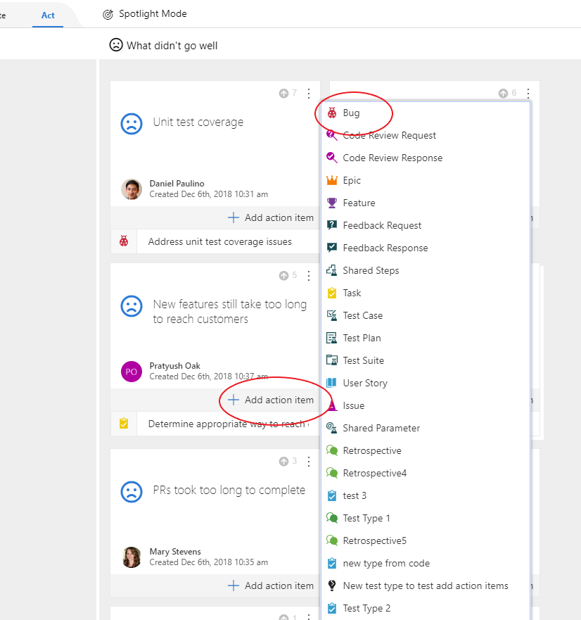
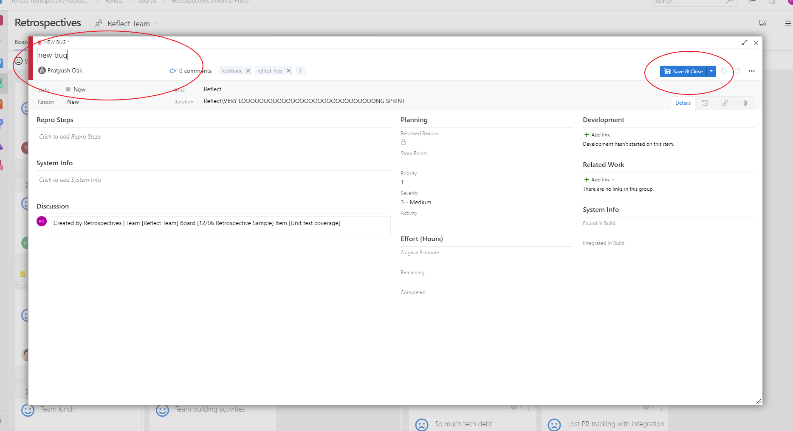
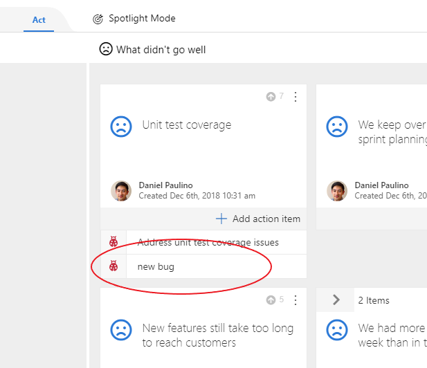

# Retrospectives

Retrospectives is an Azure DevOps extension to perform **smart and efficient retrospectives from within the Azure DevOps pipeline.** Retrospectives are an important part of the software engineering cycle. Teams often use external retrospective tools, white board with Post-its, OneNote, etc to conduct retrospectives. The data then needs to be collated, and any actionable items need to be created in your Azure DevOps pipeline. The Retrospectives extension allows you to do all this and more from within Azure DevOps.

## Table of Contents

- [Features](#features)
- [Install](#install)
- [Use](#use)
- [Contribute](#contribute)
- [License](#license)

## Features

- Retrospectives in Azure DevOps
- Real time support for distributed retrospectives
- Ability to create Azure DevOps work items associated to feedback
- Create an emailable summary of a retrospective

## Install

The extension is still in preview mode and is available only to internal Microsoft users. For Microsoft accounts, installing the extension is a 3 step process -

1. Reach out to our team and let us know which DevOps organization you belong to. (Eg. MICROSOFT, MICROSOFTIT, MSENG, etc.). The extension will be shared with your org.
2. Contact an admin for your org and have them install the extension. This installation process is similar to installing any other DevOps extensions. Refer to [this link](https://docs.microsoft.com/en-us/azure/devops/marketplace/install-extension?view=vsts) for instructions.

3. Since the extension is still in preview mode, it needs to be enabled for the Azure DevOps project. Reach out to your project admin and have them enable the extension from the 'Preview Features' tab.

## Use

1. Navigate to the Azure 'Boards' tab in your account. Select the 'Retrospectives (Preview)' tab under boards.

   

2. This will navigate you to the Retrospectives page. Select your Azure DevOps team from the selector in the header.

   

3. Create a new retrospective using the 'Create Board' button. If you have created retrospectives before, use the selector to go to a particular retrospective, or create a new one using the options button and then clicking on 'Create new board'.

   

   

   

4. If you created a new retrospective in step 3, give your retrospective an appropriate name and click 'Save'. This will create and navigate you to your newly created retrospective.

   

5. Once you create a new retrospective, you can share a link to it to all participants. Users can then access that link even from their mobile browsers to participate in the retrospective. The extension offers real time synchronisation, so all users will see the most upto date information without having to refresh the page.

   

6. Each Retrospective has 2 columns, one for things that went well and another for those that did not. Performing a retrospective is divided into 4 phases.

   - **Collect** - In this phase feedback is collected from all participants. Users can add feedback under either of the columns using the 'Add new card' button. Once feedback from all users is collected, move onto the next phase.

   

   - **Group** - In this phase, the similar feedback is grouped together. If you feel 2 feedback items are similar, drag one onto another to group them together. Dragging any item onto a group, will add items to that group. Once all similar items are grouped together, move on to the next phase.

   

   - **Vote** - In this phase, participants will individually go through all the feedback items and vote on the ones they feel are important, by clicking on the 'Upvote' icon. Once everyone is done voting, move on to the next phase.

   

   - **Act** - In this phase, the team will go through each feedback item and create work items in Azure DevOps if needed. Click on the 'Add action item' button on a feedback card, and select the type of work item that needs to be created. This will open up the standard Azure DevOps work item creation form. Enter the work item details and save. This will create the work item in your Azure DevOps account and also associate it to the feedback item.

   

   

   

## Contribute

TBD

## License

Copyright (c) Microsoft Corporation. All rights reserved.
